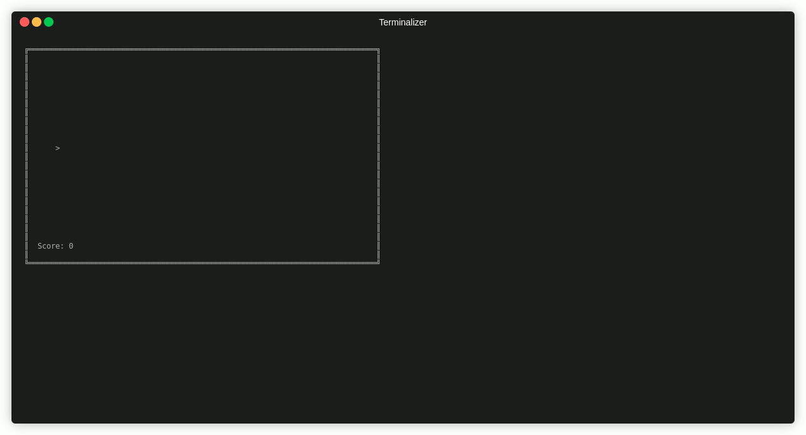

# Sendama CLI &mdash; Console Application for the Sendama 2D Game Engine
by amasiye313@gmail.com

## Description

Sendama is a 2D game engine for creating terminal based games. It is designed to be simple and easy to use, while
providing the necessary tools to create fun and engaging games. The engine is built using PHP and is designed to be
cross-platform, so you can create games that run on Windows, Linux, and macOS. Rather than using complex graphics
libraries, Sendama uses simple ASCII characters to create game worlds, making it easy to create games that are both
fun and visually appealing. By leveraging the power of ANSI escape codes, Sendama allows you to create games that are
interactive and engaging, with support for keyboard input, animations, and more.

## Running the Game

To run the game, simply run the following command:
```bash
sendama play
```



## Creating Gameplay

Sendama provides a simple API for creating games. You can create game objects, define their properties, and add them to 
the game world.

There are some topics that you should be familiar with before creating a game with Sendama:

| Topic                    | Description                                                             |
|--------------------------|-------------------------------------------------------------------------|
| [Scenes](docs/scenes.md) | Understand scenes and how to create and work with scenes in Sendama.    |
| [Game Objects](docs/game-objects.md) | Learn how to create game objects and how they work with components.     |
| [Components](docs/components.md) | Understand components and how they can be used to modify game behavior. |